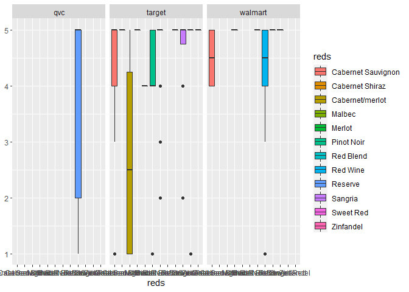
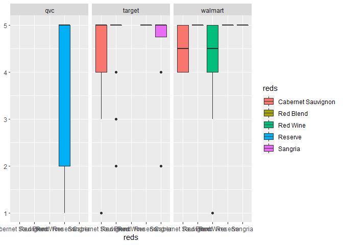
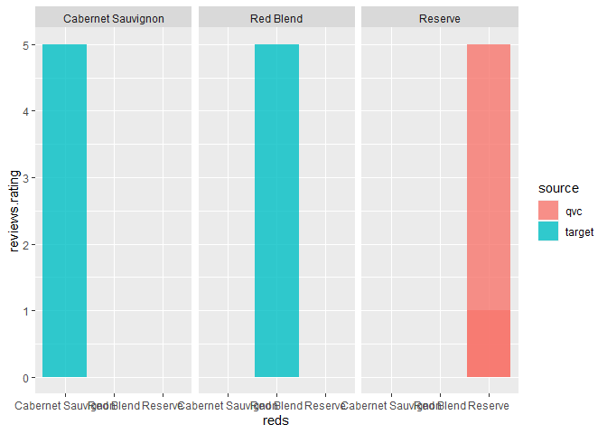
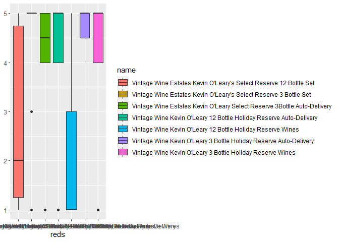
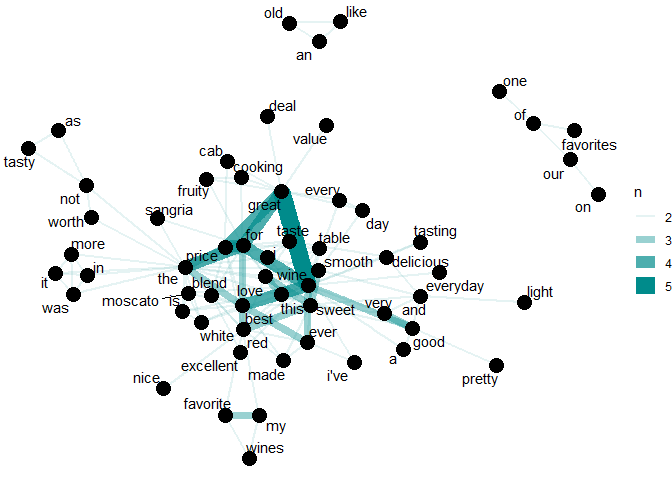
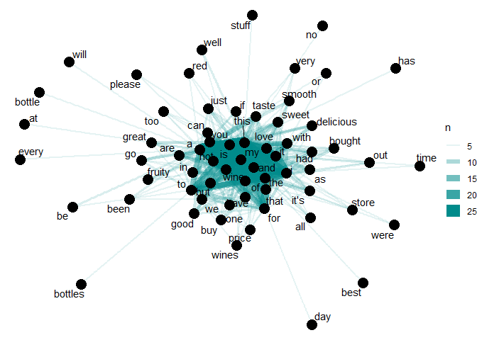
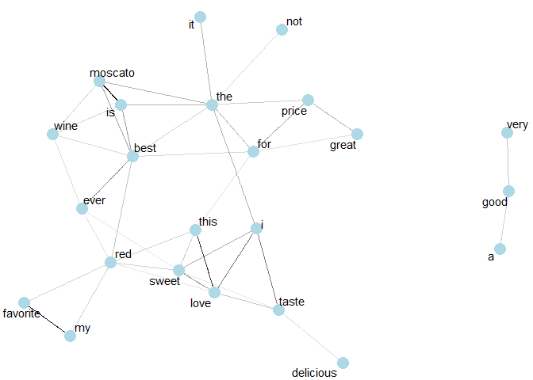
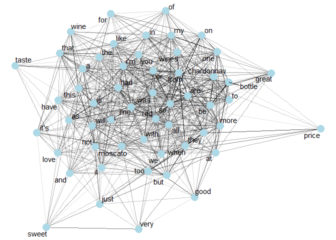
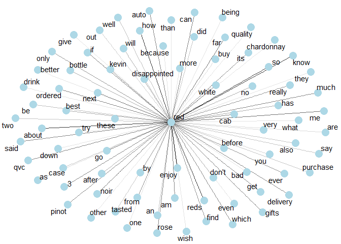

Wine Reviews
================
Rudy Meza
3/3/2022

``` r
library(tidyverse)
library(tidymodels)
library(tidytext)
library(stringr)
```

``` r
data<-read_csv("C:/Users/rudym/Downloads/archive (1)/447_1 (1).csv")
```

``` r
data %>%
  group_by(brand, name) %>%
  count()
```

    ## # A tibble: 285 x 3
    ## # Groups:   brand, name [285]
    ##    brand             name                                               n
    ##    <chr>             <chr>                                          <int>
    ##  1 1000 Stories      1000 Stories174 Zinfandel - 750ml Bottle           2
    ##  2 14 Hands Winery   14 Hands174 Red Blend - 750ml Bottle               1
    ##  3 19 Crimes         19 Crimes174 Red Blend - 750ml Bottle              2
    ##  4 603 Brewery       603174 White Peaks Ipa - 6pk / 12oz Cans           2
    ##  5 603 Brewery       603174 Winni Amber Ale - 6pk / 12oz Cans           1
    ##  6 ABSOLUT           Absolut Mandrin Vodka, 750 mL                      1
    ##  7 Admiral Nelson    Admiral Nelson Spiced Rum, 1.75 L                  1
    ##  8 ALAMOS            Alamos Malbec Wine, 750mL                          1
    ##  9 American Beverage Big Bucket Premium Margarita Mixer, 96.0 FL OZ     7
    ## 10 Angostora         Angostura Aromatic Bitters, 4 fl oz               10
    ## # ... with 275 more rows

``` r
liquor<-list("Whiskey","Tequila","Vodka","Bourbon", "Rum")
cat_liquor<-paste0(liquor, collapse = "|")
df<-data %>%
  mutate(beer = str_extract(name, "12oz|Beer|Bitters|Malt"),
         liqr = str_extract(name,cat_liquor), 
         wine = str_extract(name, "Red Blend|Champagne|Cabernet Sauvignon|Pinot Grigio|Sangria|Chardonnay|Moscato|Cabernet/merlot|Merlot|Malbec|Riesling|Zinfandel|Sweet Red|Red Blend|Sauvignon Blanc|Pinot Noir|Cabernet Shiraz|Sparkling Wine|White Blend|Wine|Harvest Collection|Blackberry Wine|Reserve|Red Wine"),
         Cocktail = ifelse(is.na(beer)&is.na(liqr)&is.na(wine), name, NA))
```

``` r
new_df<-df %>%
  mutate(qty = str_extract(gsub('"',"", quantities),"(?<=value:)\\d+"),
         liquor_full = ifelse(!is.na(liqr), name, NA),
         wine_full = ifelse(!is.na(wine), name, NA),
         beer_full = ifelse(!is.na(beer), name, NA))

counts<-new_df%>%
  filter(!is.na(qty))%>%
  group_by(wine_full,liquor_full,Cocktail, beer_full, qty)%>%
  count()
```

# Reds, Whites, and Sparkling

``` r
main<-new_df%>%
  mutate(source = str_extract(gsub('"',"", sourceURLs),"[A-z]+(?=.com)"),
         source = ifelse(source=="bazaarvoice", "qvc",source))%>%
  filter(!is.na(wine))%>%
  mutate(reds = str_extract(name,"Merlot|Cabernet/merlot|Malbec|Cabernet Sauvignon|Cabernet Shiraz|Pinot Noir|Red Blend|Red Wine|Sweet Red|Sangria|Reserve|Zinfandel"),
         sparkling=str_extract(name,"Sparkling Wine|Champagne"),
         whites = ifelse(is.na(reds) & is.na(sparkling),wine, NA))

main%>%
  filter(!is.na(reds))%>%
  ggplot(aes(reds, reviews.rating, fill=reds)) +
geom_boxplot(show.legend = TRUE) +
labs(x = "reds", y = NULL) +
facet_wrap(~as.factor(source))
```

<!-- -->

``` r
reds_list<-main %>%
  group_by(reds, .drop=F)%>%
  count()%>%
  arrange(desc(n))%>%
    filter(n >6 & !is.na(reds))%>%
  pull(reds)

main %>%
  select(reds, reviews.rating, source)%>%
  filter(reds %in% reds_list)%>%
  ggplot(aes(reds, reviews.rating, fill=reds)) +
geom_boxplot(show.legend = TRUE) +
labs(x = "reds", y = NULL)+
facet_wrap(~as.factor(source))
```

<!-- -->  
  
There seems to be alot of reviews for the reserve category of red wine.
These boxplots are for red wines with greater than 6 reviews ratings.
Here we can see that Target and Walmart do not carry the reserve. The
median rating and highest for a Caernet Sauvignon is a 5 at Target.
Walmart shows the median at a 4. Are the 5’s conistant for both stores?

``` r
main %>%
  filter(reds %in% reds_list)%>%
count(reviews.rating, reds, source)%>%
group_by(reds) %>%
  filter(n>6)%>%
ggplot(aes(reds, reviews.rating, fill=source))+
geom_col(alpha = 0.8, position="dodge", show.legend=TRUE)+
  facet_wrap(~as.factor(reds))
```

<!-- -->

``` r
main %>%
  select(reds, reviews.rating, source, name)%>%
  filter(reds %in% reds_list & source=="qvc")%>%
  ggplot(aes(name, reviews.rating, fill=name)) +
geom_boxplot(show.legend = TRUE) +
labs(x = "reds", y = NULL)
```

<!-- -->  
  

These are all of Kevin O’leary’s wines. The Holiday Reserve and the
Select Reserve.

``` r
words<-main%>%
  filter(!is.na(wine_full))%>%
  select(reviews.id,reviews.title, reviews.text)%>%
  mutate(id=as.character(reviews.id),
         title = reviews.title,
         text = reviews.text)%>%
  select(-reviews.id, -reviews.title, -reviews.text)%>%
  as_tibble()
```

``` r
library(tidytext)
reviews_title<-words%>%
  select(-text)%>%
  unnest_tokens(word, title)%>%
  filter(!word %in% stop_words)

reviews_text<-words%>%
  select(-title)%>%
  unnest_tokens(word, text) %>%
  filter(!word %in% stop_words)
```

  
  
What are the most commo words in the Review titles?

``` r
reviews_title %>%
  count(word, sort = T)
```

    ## # A tibble: 285 x 2
    ##    word      n
    ##    <chr> <int>
    ##  1 wine     47
    ##  2 great    27
    ##  3 for      21
    ##  4 good     20
    ##  5 the      19
    ##  6 best     14
    ##  7 not      14
    ##  8 love     12
    ##  9 red      12
    ## 10 a        11
    ## # ... with 275 more rows

  
  
What are the most commo words in the Review Text?

``` r
reviews_text %>%
  count(word, sort = T)
```

    ## # A tibble: 1,524 x 2
    ##    word      n
    ##    <chr> <int>
    ##  1 the     399
    ##  2 i       372
    ##  3 a       259
    ##  4 and     238
    ##  5 it      221
    ##  6 wine    204
    ##  7 to      199
    ##  8 this    184
    ##  9 is      161
    ## 10 of      132
    ## # ... with 1,514 more rows

  
  

We can exclude some stop words here, but I’m going to continue to Word
Co-occurrences and Correlations

``` r
stop_words<-c("this", "it", "the","and","of","it", "a", "i", "is", "to", "with", "as", "it's")

stop_words<-append(stop_words, c("for", "that", "in", "are"))
```

``` r
library(widyr)

title_word_paris<-reviews_title %>%
  pairwise_count(word, id, sort=T, upper=F)
title_word_paris
```

    ## # A tibble: 26,738 x 3
    ##    item1 item2      n
    ##    <chr> <chr>  <dbl>
    ##  1 wine  great      5
    ##  2 wine  best       4
    ##  3 the   for        4
    ##  4 wine  for        4
    ##  5 for   price      4
    ##  6 for   great      4
    ##  7 price great      4
    ##  8 love  sweet      3
    ##  9 sweet smooth     3
    ## 10 sweet red        3
    ## # ... with 26,728 more rows

  
  
Here we can count how many times each pair of words occur together in
the title or text field

``` r
text_word_paris<-reviews_text %>%
  pairwise_count(word, id, sort=T, upper=F)
text_word_paris
```

    ## # A tibble: 951,873 x 3
    ##    item1 item2     n
    ##    <chr> <chr> <dbl>
    ##  1 this  wine     25
    ##  2 a     this     24
    ##  3 this  is       23
    ##  4 this  and      22
    ##  5 this  the      20
    ##  6 this  i        19
    ##  7 this  of       18
    ##  8 this  it       18
    ##  9 i     it       18
    ## 10 a     is       17
    ## # ... with 951,863 more rows

  
  

We can see “this” is a commom word used for text in the review section.
For the title, we see Wine.

``` r
library(ggplot2)
library(igraph)
library(ggraph)

set.seed(534)
title_word_paris%>%
  filter(n >1)%>%
  graph_from_data_frame()%>%
  ggraph(layout="fr")+
  geom_edge_link(aes(edge_alpha=n, edge_width = n), edge_colour = "cyan4")+
  geom_node_point(size = 5)+
  geom_node_text(aes(label = name), repel = T,
                 point.padding = unit(0.2, "lines"))+
  theme_void()
```

<!-- -->  
  
Here in the title section we can see some strong connections between
“great” and “taste”, also “wine” and “love”. Next, the text

``` r
set.seed(534)
text_word_paris%>%
   filter(n >4)%>%
  graph_from_data_frame()%>%
  ggraph(layout="fr")+
  geom_edge_link(aes(edge_alpha=n, edge_width = n), edge_colour = "cyan4")+
  geom_node_point(size = 5)+
  geom_node_text(aes(label = name), repel = T,
                 point.padding = unit(0.2, "lines"))+
  theme_void()
```

<!-- -->

``` r
reviews_title %>%
  group_by(word)%>%
  filter(n()> 5 & !is.na(id))%>%
  pairwise_cor(word, id, sort=T, upper=F)%>%
  filter(correlation > .15)%>%
  graph_from_data_frame()%>%
  ggraph(layout="fr")+
  geom_edge_link(aes(edge_alpha=correlation),show.legend = F)+
  geom_node_point(color = "lightblue",size = 5)+
  geom_node_text(aes(label = name), repel = T)+
  theme_void()
```

<!-- -->  
We see some interesting correlations between red and favorite, also best
with moscato too.

``` r
reviews_text %>%
  group_by(word)%>%
  filter(n()> 25)%>%
  pairwise_cor(word, id, sort=T, upper=F)%>%
  filter(correlation > .15)%>%
  graph_from_data_frame()%>%
  ggraph(layout="fr")+
  geom_edge_link(aes(edge_alpha=correlation),show.legend = F)+
  geom_node_point(color = "lightblue",size = 5)+
  geom_node_text(aes(label = name), repel = T)+
  theme_void()
```

<!-- -->

  
This shows there are plenty of words that are correlated with one
another. Next, see how red wine looks.

``` r
reviews_text %>%
  group_by(word)%>%
  filter(n()> 10)%>%
  pairwise_cor(word, id, sort=T, upper=F)%>%
  filter(correlation > .15)%>%
  filter(item1=="red")%>%
  graph_from_data_frame()%>%
  ggraph(layout="fr")+
  geom_edge_link(aes(edge_alpha=correlation),show.legend = F)+
  geom_node_point(color = "lightblue",size = 5)+
  geom_node_text(aes(label = name), repel = T)+
  theme_void()
```

<!-- -->
